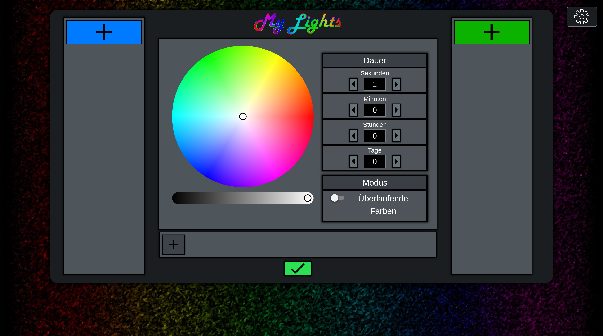
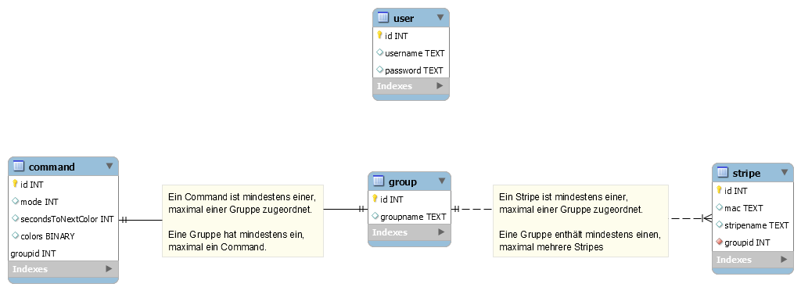

# MyLights
### Server and MCU Code for MyLights Project

## What is Mylights?
MyLights is a selfmade System to control Multiple LED Stripes.
It is based on a Spring-Boot server application and multiple NodeMCU devices (ESP8266) as clients.
The LED stripe current flow is controlled by the pins of the MCU (over transistors in our case).

##### MyLights Panel


#### MyLights Demo


## How to set up MyLights?
1. Compile the Server with Maven and run the JAR.
2. Download and install ArduinoIDE and the related libs (Vector.h, ESP8266 stuff).
3. Alter the WiFi access data and the IP/hostname of the server.
4. Flash the program with ArduinoIDE, connect the wires and start the MCU.
5. Open the Controlpanel of the Server and use the default password to log in. (Gl0w_up!)
6. Create a new group and add the Module, that should have registered itself at the server.


##### ER Diagram (deprecated)


##### API
```
GET
/
/h2-console


POST
/group/create
    -   groupName
/group/update
    -   groupId
    -   groupName
/group/delete
    -   groupId
/group/get/all

/command/set
    -   jsonData
/command/get/all
/command/get/group
    -   groupId

/stripe/register
    -   ip
    -   mac
/stripe/unassign
    -   stripeId
/strupe/update
    -   stripeId
    -   stripeName
/stripe/get/all
/stripe/set/group
    -   stripeId
    -   groupId
/stripe/get/group
    -   groupId
/stripe/get/unassigned
```


##### Example JSON Command
````json
{
	"command":
	{
		"mode":"m",
		"secondsToNextColor":2,
		"groupId":1,
		"colors":
		[
			{
				"red":255,
				"green":0,
				"blue":0
			},
			{
				"red":0,
				"green":255,
				"blue":0
			},
			{
				"red":0,
				"green":0,
				"blue":255
			}
		]
	}
}
````