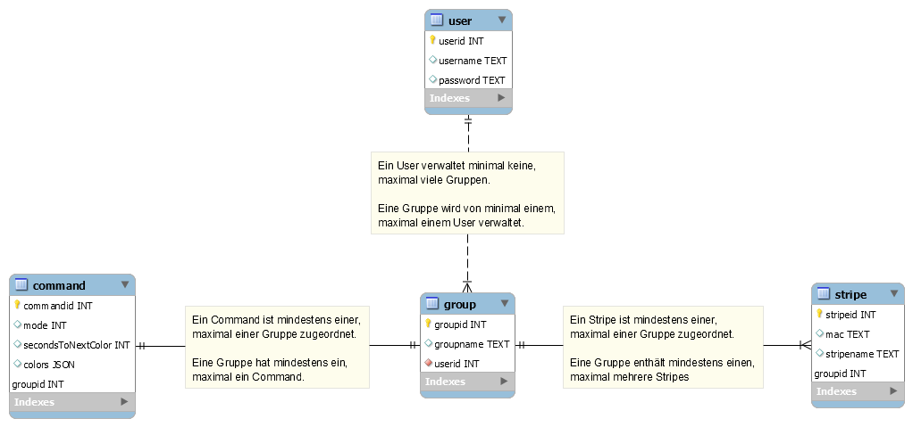

# MyLightsServer
Server for MyLights Project

ER Diagram


Example JSON Command
````json
{
	"command":
	{
		"mode":"m",
		"secondsToNextColor":2,
		"groupId":1,
		"colors":
		[
			{
				"red":255,
				"green":0,
				"blue":0
			},
			{
				"red":0,
				"green":255,
				"blue":0
			},
			{
				"red":0,
				"green":0,
				"blue":255
			}
		]
	}
}
````